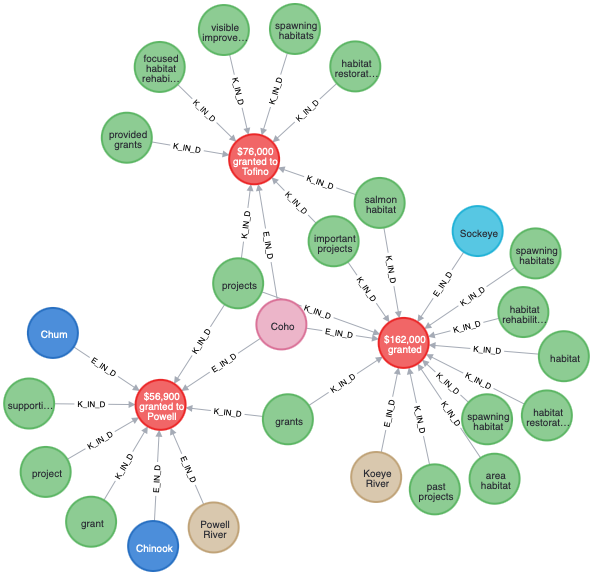
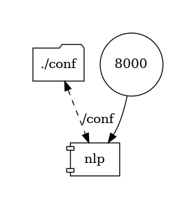

# Proof of Concept
## Pacific Salmon Knowledge Graph Initiative

### A. Overview
DFO’s Pacific Salmon Strategy (PSS) is a multi-branch initiative that seeks to transform the governance, management and assessment of salmon in the Pacific Region. Those leading this initiative, which is anticipated to begin in earnest in 2021, recognize the potential of applying Knowledge Graph (KG) (or labelled property graph, e.g. Neo4j.com) technology to assist in the assembly, storage and interpretation of complex salmon-related data and information.

One focus of the initiative is on information pertaining to current salmon rebuilding activities, building upon earlier KG work, including some that focused on southern BC Chinook salmon.

This **Proof of Concept** (PoC) is intended to demonstrate the value of KG technology as a means of helping to achieve the overall goals of the PSS by showcasing data processing procedures for assembly, cleaning, transformation (standardization), loading, and linking of data from text sources (e.g. reports, Word documents and Excel spreadsheets) into nodes and links in a Salmon Knowledge Graph.

### B. Quick-start

##### 1. Prerequisite

Following software are required, please install their latest versions:
- `Docker Desktop`/`Docker Engine`
- `Docker Compose`
- `Python 3.8+`
- `git`
- `pskgi_poc` (this repository)

<details><summary>Click for details!</summary>

###### Step 1 - Install `Docker Desktop`/`Docker Engine`
For macOS or Windows install [Docker Desktop](https://docs.docker.com/desktop/).

For people who know what WSL is: Installing `Windows Subsystem for Linux 2`, a.k.a `WSL2` is highly recommended before installing Docker Desktop.

For Linux, install [Docker Engine](https://docs.docker.com/engine/).

**Important**: it is recommended that at least 6GB memory and 10GB disk space allowed for Docker Desktop. Check the `Preferences`, and then `Resources` menu-item of the `Docker` top menu icon to adjust them.

###### Step 2 - Install `Docker Compose`
For all system, install [Docker Compose](https://docs.docker.com/compose/).

###### Step 3 - Install `git`
Make sure that you have `git` install on your system.

- For Windows: Download [Git for Windows](https://git-scm.com/download/win) and install it.

- For macOS: install [homebrew](https://brew.sh), and then in Terminal:

      brew install git

- For Debian-based Linux:

      sudo apt update
      sudo apt upgrade
      sudo apt install git


- For RPM-based Linux:

      sudo yum upgrade
      sudo yum install git

*For Ubuntu: in case permission error is encountered at the first run of docker-compose, try to create the docker user group and add yourself to it*

    sudo groupadd docker
    sudo usermod -aG docker ${USER}

###### Step 4 - Install `Python`
Follow instructions this [guide](https://installpython3.com/).

###### Step 5 - Install `pskgi_poc` (this repository):
Check out the [repo](https://github.com/nghia71/pskgi_poc) by opening a Terminal or Command Prompt on your system, go to a directory where you want to place this repository, and type:

    git clone https://github.com/nghia71/pskgi_poc.git
    cd pskgi_poc

Collect addtional libraries for `neo4j`:

    ./gather_neo4j_plugins.sh

</details>

##### 2. Shortcut to demo:

Assume that you are in `pskgi_poc` directory:

    ./run.sh

Wait until you see the following line, it would mean all three docker containers (nlp, neo4j, show) are running.

    neo4j    | 2021-01-27 23:37:39.305+0000 INFO  Started.

Open the browser, go to http://localhost:7474, enter username (neo4j) and password (pskgi), type the below and press `[Ctrl/Cmd]+Enter`:

      :play http://localhost:8001/html/show.html

and follow the instructions on the screen.


##### 3. Setting up the Dockers:
The dockers can be managed via several steps:
- Obtain the dockers by pulling the docker images from Docker Hub.
- Stop the running containers
- Removing unused images

<details><summary>Click for details!</summary>

Make sure that all requirements in `1. Prerequisite` are satisfied.
It it **important** to note that all `docker` and `docker-compose` command must be execute inside the `pskgi_poc` repo directory, where the `docker-compose.yml` is present.

###### a. Obtain the dockers by pulling the built docker images from [repositories](https://hub.docker.com/repository/docker/nghiadh/nlp) on Docker Hub, create the containers, and run them

    docker-compose pull
    docker-compose up --no-build

*Note: it will takes sometimes to download about 2GB image.*

Add a `-d` option if you want them run in the background

    docker-compose up -d --no-build

***[Optional]: Build the docker images, create the containers, and run them***

Rebuild the image:

    docker-compose up --build

*Note: it will takes sometimes to download `PyTorch` (700MB), and neural English language models for `stanza`.*

Add a `-d` option if you want them run in the background

    docker-compose up -d --build

Later invocations:

    docker-compose up


###### b. Stop the running containers

If they are running on the console (i.e. without `-d` option). Press `Ctrl+C` to gracefully shutdow.

You can also stop it from the other Terminal (in `pskgi_poc` directory):

    docker-compose down

###### c. Removing unused images

    docker image prune

*Note: it is worth to run because it can remove over 3.5GB temporary data produced during the build of the docker image*

</details>

##### 4. Using the Dockers:

Instructions to use and/or monitor following dockers:
- `nlp`
- `neo4j`
- `show`

<details><summary>Click for details!</summary>

##### a. `nlp`:

Assume that you are in `pskgi_poc` directory, check if it's running:

    cd test

**For macOS, Linux**

    ./check_nlp.sh http://127.0.0.1:8000/

**For Windows**

Assume that you are in `pskgi_poc` directory, check if it's running:

    check_nlp.bat http://127.0.0.1:8000/

If the script prints `"OK"`, the service is ready, then test it with proper input. You should see `json` output on the console.

**For macOS, Linux**

    ./test_nlp.sh http://127.0.0.1:8000/process/ nlp_input.txt

**For Windows**

    test_nlp.bat http://127.0.0.1:8000/process/ nlp_input.txt


*Note 1: the `nlp` docker is accessible from anywhere if the host's IP and port 8000 is reachable.*

*Note 2: see the Input and Output sections of the Natural Language Processing (NLP) micro service for more details*

##### b. `neo4j`:

Assume that you are in `pskgi_poc` directory, check if it's running:

    cd test

**For macOS, Linux**

    ./data_tasks.sh t neo4j neo4j pskgi bolt://localhost:7687/

**For all OS**

You can start a browser and points it at http://localhost:7474/.

*Note 1: the `neo4j` docker is accessible from anywhere if the host's IP and port 7474 is reachable.*

Create a new set of unique constraints and indexes defined in a `Cypher Query Language` (`cql`) script, which is placed in the local `cql/` directory.

    ./data_tasks.sh a neo4j neo4j pskgi bolt://localhost:7687 cql/nlp_schema.cql

Import data from a `xlsx` formatted data file, placed in `import/` directory, for example `input.xlsx`. There is no need for prefix `import/` since `neo4j` will see it at the mounted volume inside the container.

    ./data_tasks.sh j neo4j neo4j pskgi bolt://localhost:7687 /input.xlsx psf_news\!A1:B6 http://nlp:8000/process/

Open the browser, go to http://localhost:7474, enter username (neo4j) and password (pskgi), type the below and press `[Ctrl/Cmd]+Enter`:

    MATCH (e:NE)-[:E_IN_S]->(s)<-[:E_IN_S]-(loc:LOC)-[:W_IN_E]-(w:LW)
      WHERE e.c IN ["Coho", "Chinook", "Chum", "Sockeye"] AND w.l = "river"
    WITH e, loc
      MATCH (e)-[:E_IN_D]->(d)<-[:K_IN_D]-(k:KP)-[:W_IN_K]-(w:LW)
        WHERE w.l IN ["habitat", "project", "grant"]
    WITH DISTINCT(d) AS d, e, COLLECT(DISTINCT(loc)) AS oc, COLLECT(DISTINCT(k)) AS kc
    RETURN DISTINCT(e) AS species, COLLECT([d, oc, kc]) AS mentioned_locations;



##### c. `show`:

  A simple docker, to host the interactive slideshow.

    docker-compose pull
    docker-compose up --no-build

  To build this docker:

    docker-compose up --build show

  Open the brower, go to http://localhost:7474, enter username (neo4j) and password (pskgi), type the below and press `[Ctrl/Cmd]+Enter`:

    :play http://localhost:8001/html/show.html

  and follow the instructions on the screen.

</details>

### C. Micro Service Architecture



### D. Services

#### 1. Natural Language Processing (NLP) as micro service

This NLP micro service (`nlp`) is to provide an internal feature that:
- accept `human language text` in plain textual Unicode format with UTF-8 encoding.
- convert given text into lists of sentences and words, to generate base forms of those words, their parts of speech and morphological features, to give a syntactic structure dependency parse, and to recognize named entities.
- assemble extracted `key phrases` (based on customizable *syntactic treebank annotations*), `named entities`, and `sentiment score` into json objects as result.

The *back-end* of `nlp` incorporates [Stanza](https://stanfordnlp.github.io/stanza/), a Python natural language analysis package, which is built with highly accurate neural network components that also enable efficient training and evaluation with your own annotated data. The modules are built on top of the [PyTorch](https://pytorch.org) library. Stanza also provides the official Python wrapper for accessing [the Java Stanford CoreNLP package](https://stanfordnlp.github.io/CoreNLP/).

The *front-end* of `nlp` is a lightweight web server based on [Uvicorn](https://www.uvicorn.org), a fast `ASGI` (*Asynchronous Server Gateway Interface*). It accepts HTTP requests, forwards them to the back-end, and returns responses coming back from the back-end to the caller.

##### Input
How input is submitted to `nlp`:
- a HTTP POST request to **http://`HOST_NAME`:8000/process/**
- A `json` document formatted as below must be sent in the `request's body`

<details><summary>Click for details!</summary>


      ####################
      # Define the document model that the webapp receives from submission:
      # It is a json format:
      # {
      #   "u": the uid of the document, the webapp retains and returns it
      #   "c": the textual content of the document.
      # }

</details>

##### Output:
`nlp` processes the document and extracts for each sentence:
- `sentiment score`
- `named entities` (18 named entity types
described [here](https://stanfordnlp.github.io/stanza/available_models.html).
- `noun phrases` based on given *treebank annotations* that is configurable
in *conf/nlp.ini*, section *key_phrase*, entry *grammar*.

<details><summary>Click for details!</summary>

  Output is a `json` document in following format:

      {
          'u': the uid of the document
          'p': the processed content, see PostProcessor for more information
      }

  Processed document is represented by a list of sentences, each is a dictionary:

      {
          't': the original text of the sentence,
          's': the sentiment score (0, 1, 2), as a string,
          'e': list of extracted entities (see below),
          'k': list of extracted key phrases, for format see below
      }

    Extracted entities of a document is a list of dictionaries:

      {
          't': the entity type, one of the 18 named entity types, e.g. PERSON,
          'c': the textual content, for example `First Nations`,
          'w': list of words, each is a dictionary, see below
      }

    Extracted key phrases of a sentence is a list of dictionaries:

      {
          'c': the textual content, e.g. `restoration stock assessment activities`
          'w': list of words, each is a dictionary, see below
      }

    Extracted word in format of {'c': word text, 'l': lemmatized form}

    *Note: a key phrase is collected from a sentence by using treebank-specific grammar on the `xpos` property of each word in a sentence:*

      JJ? ((VB[G|N|D]|NN[P]?[S]?) (HYPH|IN|POS)*)* NN[P]?[S]?

</details>

##### Sample input & output:

<details>
  <summary>Sample input, click for more!</summary>

  Sample input from [PSF](https://www.psf.ca/news-media/238056-granted-16-south-vancouver-island-salmon-community-projects-pacific-salmon), this can be located at `test/nlp_input.txt`

      [
        {
          "u":"123",
          "c":"The Pacific Salmon Foundation (PSF) announces grants for 16 projects in the South Vancouver Island region, totalling $238,056 through the PSF Community Salmon Program (CSP). The total value of the projects, which includes community fundraising, contributions and volunteer time, is $1,488,711 and is focused on the rehabilitation of key Pacific salmon habitats and stock enhancement in the South Vancouver Island area."
        }
      ]
</details>

<details>
  <summary>Sample output, click for more!</summary>

  Sample output from processing of the above input.

    [
        {
            "p": [
                {
                    "c": "The Pacific Salmon Foundation (PSF) announces grants for 16 projects in the South Vancouver Island region, totalling $238,056 through the PSF Community Salmon Program (CSP).",
                    "e": [
                        {
                            "c": "The Pacific Salmon Foundation (PSF)",
                            "t": "ORG",
                            "w": [
                                {
                                    "c": "Pacific",
                                    "l": "pacific"
                                },
                                {
                                    "c": "Salmon",
                                    "l": "salmon"
                                },
                                {
                                    "c": "Foundation",
                                    "l": "foundation"
                                },
                                {
                                    "c": "(",
                                    "l": "("
                                },
                                {
                                    "c": "PSF",
                                    "l": "psf"
                                },
                                {
                                    "c": ")",
                                    "l": ")"
                                }
                            ]
                        },
                        {
                            "c": "16",
                            "t": "CARDINAL",
                            "w": [
                                {
                                    "c": "16",
                                    "l": "16"
                                }
                            ]
                        },
                        {
                            "c": "South Vancouver Island",
                            "t": "LOC",
                            "w": [
                                {
                                    "c": "South",
                                    "l": "south"
                                },
                                {
                                    "c": "Vancouver",
                                    "l": "vancouver"
                                },
                                {
                                    "c": "Island",
                                    "l": "island"
                                }
                            ]
                        },
                        {
                            "c": "238,056",
                            "t": "MONEY",
                            "w": [
                                {
                                    "c": "238,056",
                                    "l": "238,056"
                                }
                            ]
                        },
                        {
                            "c": "PSF Community Salmon Program",
                            "t": "ORG",
                            "w": [
                                {
                                    "c": "PSF",
                                    "l": "psf"
                                },
                                {
                                    "c": "Community",
                                    "l": "community"
                                },
                                {
                                    "c": "Salmon",
                                    "l": "salmon"
                                },
                                {
                                    "c": "Program",
                                    "l": "program"
                                }
                            ]
                        },
                        {
                            "c": "CSP",
                            "t": "ORG",
                            "w": [
                                {
                                    "c": "CSP",
                                    "l": "csp"
                                }
                            ]
                        },
                        {
                            "c": "1,488,711",
                            "t": "MONEY",
                            "w": [
                                {
                                    "c": "1,488,711",
                                    "l": "1,488,711"
                                }
                            ]
                        },
                        {
                            "c": "Pacific",
                            "t": "LOC",
                            "w": [
                                {
                                    "c": "Pacific",
                                    "l": "pacific"
                                }
                            ]
                        },
                        {
                            "c": "South Vancouver Island",
                            "t": "LOC",
                            "w": [
                                {
                                    "c": "South",
                                    "l": "south"
                                },
                                {
                                    "c": "Vancouver",
                                    "l": "vancouver"
                                },
                                {
                                    "c": "Island",
                                    "l": "island"
                                }
                            ]
                        }
                    ],
                    "k": [
                        {
                            "c": "pacific",
                            "w": [
                                {
                                    "c": "pacific",
                                    "l": "pacific"
                                }
                            ]
                        },
                        {
                            "c": "salmon",
                            "w": [
                                {
                                    "c": "salmon",
                                    "l": "salmon"
                                }
                            ]
                        },
                        {
                            "c": "foundation",
                            "w": [
                                {
                                    "c": "foundation",
                                    "l": "foundation"
                                }
                            ]
                        },
                        {
                            "c": "psf",
                            "w": [
                                {
                                    "c": "psf",
                                    "l": "psf"
                                }
                            ]
                        },
                        {
                            "c": "grants",
                            "w": [
                                {
                                    "c": "grants",
                                    "l": "grant"
                                }
                            ]
                        },
                        {
                            "c": "projects",
                            "w": [
                                {
                                    "c": "projects",
                                    "l": "project"
                                }
                            ]
                        },
                        {
                            "c": "south",
                            "w": [
                                {
                                    "c": "south",
                                    "l": "south"
                                }
                            ]
                        },
                        {
                            "c": "vancouver",
                            "w": [
                                {
                                    "c": "vancouver",
                                    "l": "vancouver"
                                }
                            ]
                        },
                        {
                            "c": "island",
                            "w": [
                                {
                                    "c": "island",
                                    "l": "island"
                                }
                            ]
                        },
                        {
                            "c": "region",
                            "w": [
                                {
                                    "c": "region",
                                    "l": "region"
                                }
                            ]
                        },
                        {
                            "c": "psf community salmon program",
                            "w": [
                                {
                                    "c": "psf",
                                    "l": "psf"
                                },
                                {
                                    "c": "community",
                                    "l": "community"
                                },
                                {
                                    "c": "salmon",
                                    "l": "salmon"
                                },
                                {
                                    "c": "program",
                                    "l": "program"
                                }
                            ]
                        },
                        {
                            "c": "csp",
                            "w": [
                                {
                                    "c": "csp",
                                    "l": "csp"
                                }
                            ]
                        }
                    ],
                    "s": 1
                },
                {
                    "c": "The total value of the projects, which includes community fundraising, contributions and volunteer time, is $1,488,711 and is focused on the rehabilitation of key Pacific salmon habitats and stock enhancement in the South Vancouver Island area.",
                    "e": [
                        {
                            "c": "The Pacific Salmon Foundation (PSF)",
                            "t": "ORG",
                            "w": [
                                {
                                    "c": "Pacific",
                                    "l": "pacific"
                                },
                                {
                                    "c": "Salmon",
                                    "l": "salmon"
                                },
                                {
                                    "c": "Foundation",
                                    "l": "foundation"
                                },
                                {
                                    "c": "(",
                                    "l": "("
                                },
                                {
                                    "c": "PSF",
                                    "l": "psf"
                                },
                                {
                                    "c": ")",
                                    "l": ")"
                                }
                            ]
                        },
                        {
                            "c": "16",
                            "t": "CARDINAL",
                            "w": [
                                {
                                    "c": "16",
                                    "l": "16"
                                }
                            ]
                        },
                        {
                            "c": "South Vancouver Island",
                            "t": "LOC",
                            "w": [
                                {
                                    "c": "South",
                                    "l": "south"
                                },
                                {
                                    "c": "Vancouver",
                                    "l": "vancouver"
                                },
                                {
                                    "c": "Island",
                                    "l": "island"
                                }
                            ]
                        },
                        {
                            "c": "238,056",
                            "t": "MONEY",
                            "w": [
                                {
                                    "c": "238,056",
                                    "l": "238,056"
                                }
                            ]
                        },
                        {
                            "c": "PSF Community Salmon Program",
                            "t": "ORG",
                            "w": [
                                {
                                    "c": "PSF",
                                    "l": "psf"
                                },
                                {
                                    "c": "Community",
                                    "l": "community"
                                },
                                {
                                    "c": "Salmon",
                                    "l": "salmon"
                                },
                                {
                                    "c": "Program",
                                    "l": "program"
                                }
                            ]
                        },
                        {
                            "c": "CSP",
                            "t": "ORG",
                            "w": [
                                {
                                    "c": "CSP",
                                    "l": "csp"
                                }
                            ]
                        },
                        {
                            "c": "1,488,711",
                            "t": "MONEY",
                            "w": [
                                {
                                    "c": "1,488,711",
                                    "l": "1,488,711"
                                }
                            ]
                        },
                        {
                            "c": "Pacific",
                            "t": "LOC",
                            "w": [
                                {
                                    "c": "Pacific",
                                    "l": "pacific"
                                }
                            ]
                        },
                        {
                            "c": "South Vancouver Island",
                            "t": "LOC",
                            "w": [
                                {
                                    "c": "South",
                                    "l": "south"
                                },
                                {
                                    "c": "Vancouver",
                                    "l": "vancouver"
                                },
                                {
                                    "c": "Island",
                                    "l": "island"
                                }
                            ]
                        }
                    ],
                    "k": [
                        {
                            "c": "total value",
                            "w": [
                                {
                                    "c": "total",
                                    "l": "total"
                                },
                                {
                                    "c": "value",
                                    "l": "value"
                                }
                            ]
                        },
                        {
                            "c": "projects",
                            "w": [
                                {
                                    "c": "projects",
                                    "l": "project"
                                }
                            ]
                        },
                        {
                            "c": "community fundraising",
                            "w": [
                                {
                                    "c": "community",
                                    "l": "community"
                                },
                                {
                                    "c": "fundraising",
                                    "l": "fundraising"
                                }
                            ]
                        },
                        {
                            "c": "contributions",
                            "w": [
                                {
                                    "c": "contributions",
                                    "l": "contribution"
                                }
                            ]
                        },
                        {
                            "c": "volunteer time",
                            "w": [
                                {
                                    "c": "volunteer",
                                    "l": "volunteer"
                                },
                                {
                                    "c": "time",
                                    "l": "time"
                                }
                            ]
                        },
                        {
                            "c": "rehabilitation",
                            "w": [
                                {
                                    "c": "rehabilitation",
                                    "l": "rehabilitation"
                                }
                            ]
                        },
                        {
                            "c": "key pacific",
                            "w": [
                                {
                                    "c": "key",
                                    "l": "key"
                                },
                                {
                                    "c": "pacific",
                                    "l": "pacific"
                                }
                            ]
                        },
                        {
                            "c": "salmon habitats",
                            "w": [
                                {
                                    "c": "salmon",
                                    "l": "salmon"
                                },
                                {
                                    "c": "habitats",
                                    "l": "habitat"
                                }
                            ]
                        },
                        {
                            "c": "stock enhancement",
                            "w": [
                                {
                                    "c": "stock",
                                    "l": "stock"
                                },
                                {
                                    "c": "enhancement",
                                    "l": "enhancement"
                                }
                            ]
                        },
                        {
                            "c": "south",
                            "w": [
                                {
                                    "c": "south",
                                    "l": "south"
                                }
                            ]
                        },
                        {
                            "c": "vancouver",
                            "w": [
                                {
                                    "c": "vancouver",
                                    "l": "vancouver"
                                }
                            ]
                        },
                        {
                            "c": "island",
                            "w": [
                                {
                                    "c": "island",
                                    "l": "island"
                                }
                            ]
                        },
                        {
                            "c": "area",
                            "w": [
                                {
                                    "c": "area",
                                    "l": "area"
                                }
                            ]
                        }
                    ],
                    "s": 2
                }
            ],
            "u": "123"
        }
    ]
</details>

##### Limitations:
Following features are not included:
1. Multiple language support (only English at the moment).
2. Dynamic treebank annotations parsing (to obtain key phrases with different grammatical compositions)
3. Dependency-parsing (that builds a tree structure of words from the input sentence, which represents the syntactic dependency relations between words)
4. Enabling GPU usage inside container for better ML performance.
5. Configurable parallel processing and throughput for higher performance.

#### 2. Neo4j graph database as micro service

`Neo4j` Graph Database CE (Community Edition), `4.2.2` is assembled inside `docker-compose.yml`. Following additional features are added
- Graph Data Science ([GPS](https://neo4j.com/developer/graph-data-science/)) library, version `1.4.1`.
- Awesome Procedures On Cypher ([APOC](https://neo4j.com/labs/apoc/)) library, version `4.2.0.1`.
- A set of `Apache` `POI` and dependency for [importing Excel](https://neo4j.com/labs/apoc/4.2/import/xls/) spreadsheets in both `xls` and `xlsx` format.

All required libraries must be downloaded prior to start the `neo4j` docker by running:

    ./gather_neo4j_plugins.sh

The libraries are placed in the local `plugins/` directory, which will be mounted as a local folder for `neo4j` docker.

- `neo4j` docker image based on `neo4j:4.2.2` in Docker Hub and configured:
  + automatically accept user license
  + use max 2GB memory for heap, 1GB for page cache
  + import files from the mounted local `import/` directory
  + load additional libraries from the mounted local `plugins/` directory
  + keeps the physical database files in the mounted local `data/` directory
  + generates log entires in the `debug.log` file in the mounted local `logs/` directory

##### Running tasks
Several tasks can be executed with `neo4j` service, to see what you can do, try:

    ./data_tasks.sh

You should see the following print out:

```
Usage: ./data_tasks.sh <COMMANDS> <NEO4J_CONTAINER> <USER_NAME> <PASSWORD> <BOLT_URL>
  COMMAND:
      a: add new schema (unique constraints & indexes)
      j: nlp and import json file (inside import/ directory)
      x: nlp and import data xls(x) file (inside import/ directory)
      c: clean up by remove all nodes and relationships
      r: remove schema
      s: print database statistics
      t: test if database ready
  EXAMPLES:
      ./data_tasks.sh t: test if database ready
      ./data_tasks.sh a: add new schema
      ./data_tasks.sh j: nlp and import json file
      ./data_tasks.sh x: nlp and import data xls(x) file
      ./data_tasks.sh c: clear database
      ./data_tasks.sh r: remove schema
      ./data_tasks.sh cr: run an c -> r pipeline
      ./data_tasks.sh s: print database statistics
  NEO4J_CONTAINER: the name of the running container, e.g. neo4j
  USER_NAME: username to access neo4j database, e.g neo4j
  PASSWORD: password to access neo4j database, e.g pskgi
  BOLT_URL: Bolt-based URL to access neo4j database, e.g bolt://localhost:7687
  EXAMPLES:
      ./data_tasks.sh t neo4j neo4j pskgi bolt://localhost:7687
```

<details><summary>Click for details!</summary>

Test if `neo4j` docker container is running:

    ./data_tasks.sh t neo4j neo4j pskgi bolt://localhost:7687

[Optional] Clear - remove all nodes and relationships from - the database (note that this might slow down for large database):

    ./data_tasks.sh c neo4j neo4j pskgi bolt://localhost:7687

[Optional] Remove all unique constraints and indexes from the database :

    ./data_tasks.sh r neo4j neo4j pskgi bolt://localhost:7687

[Optional] Create a new set of unique constraints and indexes defined in a `Cypher Query Language` (`cql`) script, which is placed in the local `cql/` directory. Note that this needs to be done only once and before any data import

    ./data_tasks.sh a neo4j neo4j pskgi bolt://localhost:7687 cql/nlp_schema.cql

Import data from a `json` formatted data file, placed in `import/` directory, for example `input.json`. There is no need for prefix `import/` since `neo4j` will see it at the mounted volume inside the container. Note that
the `nlp` service is access at the URL http://nlp:8000/process/. `neo4j` and `nlp` services communicate via a private network `backend`, which is not exposed outside, so `neo4j` *sees* `nlp` by its own hostname `nlp`.

    ./data_tasks.sh j neo4j neo4j pskgi bolt://localhost:7687 input.json http://nlp:8000/process/

Import data from a `xlsx` formatted data file, placed in `import/` directory, for example `input.xlsx`. There is no need for prefix `import/` since `neo4j` will see it at the mounted volume inside the container. Note that
the `nlp` service is access at the URL http://nlp:8000/process/. `neo4j` and `nlp` services communicate via a private network `backend`, which is not exposed outside, so `neo4j` *sees* `nlp` by its own hostname `nlp`.

    ./data_tasks.sh j neo4j neo4j pskgi bolt://localhost:7687 /input.xlsx psf_news\!A1:B6 http://nlp:8000/process/

*Important*: the slash `/` in `/input.xlsx` is mandatory. The `!` in `psf_news\!A1:B6` is to escape the special character `!` in shell command. Note that the `psf_news\!A1:B6` is considered as a input sheet. Line numbers starts at 0, so `psf_news\!A1:B6` means to use cells from the region `A2:B6` in the Excel file.

</details>
